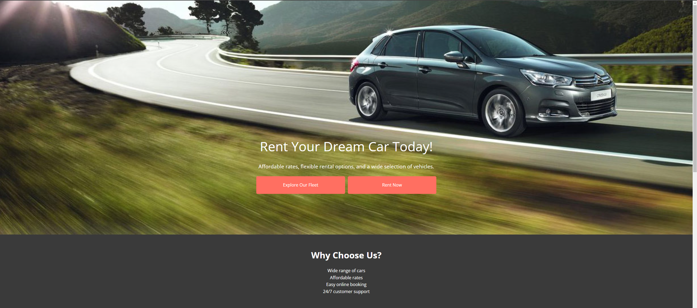
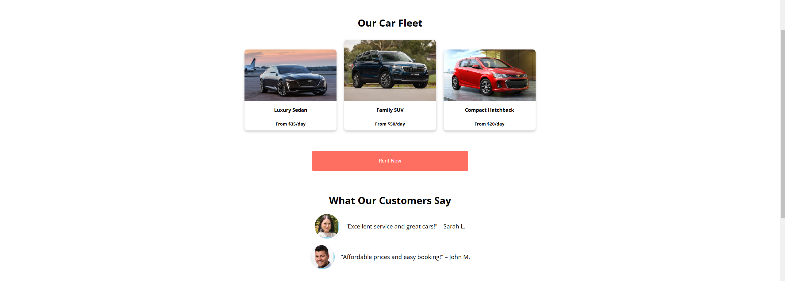
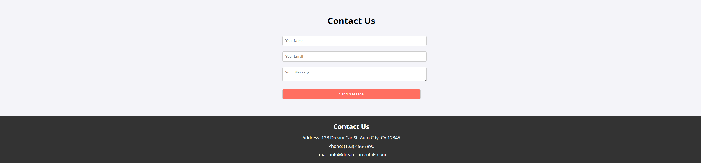
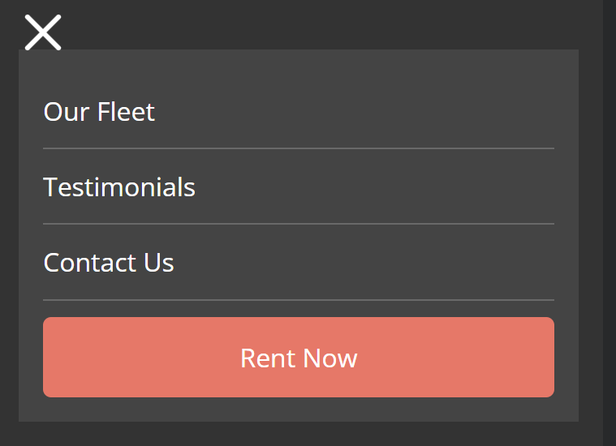
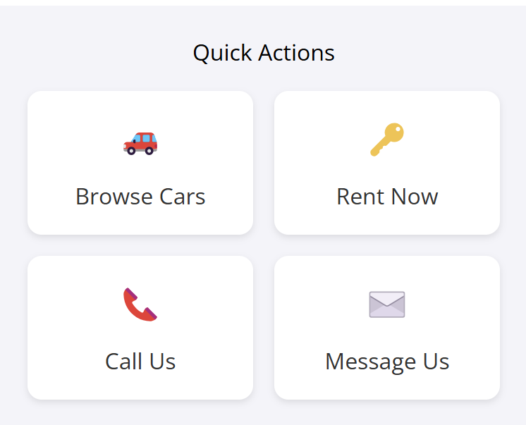
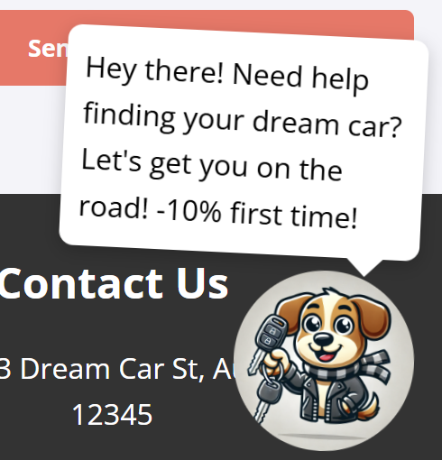

# Dream Car Rentals - Landing Page

Welcome to the **Dream Car Rentals** landing page! This page allows users to explore a wide selection of cars available for rent, learn about the benefits of choosing Dream Car Rentals, and easily contact us or rent a vehicle.

## Table of Contents

- [Features](#features)
- [Installation](#installation)
- [Usage](#usage)
- [Tailwind CSS](#tailwind-css)
- [Folder Structure](#folder-structure)
- [Demo](#demo)
- [Screenshots](#screenshots)
- [Github Pages](#github-pages)
- [Credits](#credits)

## Features

- **Hero Section**: A welcoming message and call-to-action buttons for exploring the fleet or renting a car.
- **Unique Value Proposition**: Highlights the benefits of renting with us.
- **Car Fleet Showcase**: Displays a selection of cars with images, names, and prices.
- **Customer Testimonials**: Feedback from satisfied customers.
- **Contact Us**: A simple form for visitors to get in touch.
- **Footer**: Contains contact details and company information.
- **Mobile Navigation**: A responsive mobile navigation menu that toggles visibility.
- **Mascot**: An interactive mascot that displays a message when clicked.

## Installation

1. Clone the repository to your local machine:
   ```bash
   git clone https://github.com/KaBoomKaBoom/web-programming.git
   ```
2. Open the project in your preferred code editor (e.g., VSCode, Sublime Text, etc.).

3. Open `index.html` in your browser to view the landing page.

## Usage

- Users can view the available car fleet, learn about the benefits of renting with Dream Car Rentals, read customer reviews, and fill out the contact form.
- The “Explore Our Fleet” and “Rent Now” buttons take users to the respective sections on the page for a seamless browsing experience.
- The mobile navigation menu can be toggled by clicking the hamburger icon.
- The mascot displays a helpful message when clicked on mobile version and hovered on desktop version.

## Tailwind CSS

This project leverages Tailwind CSS for rapid and responsive styling:

### Key Tailwind Features Used

- **Responsive Design**: Utility classes like `md:w-1/4` for responsive layouts
- **Flexbox and Grid**: `flex`, `flex-wrap`, `justify-center` for flexible layouts
- **Spacing and Sizing**: `py-16`, `px-4`, `mt-8` for precise spacing
- **Typography**: `text-3xl`, `font-semibold` for consistent text styling
- **Background and Color**: `bg-white`, `text-deep-orange-300` for custom colors
- **Hover States**: `hover:bg-background-hover` for interactive elements
- **Custom Color Configuration**: Extended Tailwind's color palette with custom colors

### Tailwind Configuration

The project includes a custom Tailwind configuration in the `<script>` tag:

```javascript
tailwind.config = {
  theme: {
    extend: {
      colors: {
        'deep-orange-300': '#ff6f61',
        'background-hover': '#e55a4d'
      },
    },
  },
}
```

This allows for custom color definitions that can be used throughout the project.

## Folder Structure

```
Lab2-LandingPage/
│
├── index.html        # The main landing page
├── reset.css         # CSS file for resetting default browser styles
├── styles.css        # Custom CSS file for styling the landing page
│
└── README.md         # This file
```

## Demo

You can watch a demo of the Dream Car Rentals landing page in action here:

[Responsive Landing Page Demo on YouTube](https://youtu.be/E0-d4O0oa8U)

## Screenshots

Here are some screenshots showcasing the landing page:

- **Hero Section** 

    

- **Car Fleet Showcase**  

    

- **Contact Form**  

  

- **Mobile menu**

  

- **Mobile only quick-actions menu**

  

- **Mascot**

  

## Github Pages

The landing page is deployed and available on GitHub Pages. You can view the live demo here:

[Responsive Landing Page - GitHub Pages](https://kaboomkaboom.github.io/web-programming/)

## Credits

- The fonts are imported from Google Fonts: [Open Sans](https://fonts.google.com/specimen/Open+Sans).
- All images used are free-to-use images from the internet.
- [Tailwind CSS](https://tailwindcss.com/) for the utility-first CSS framework.
